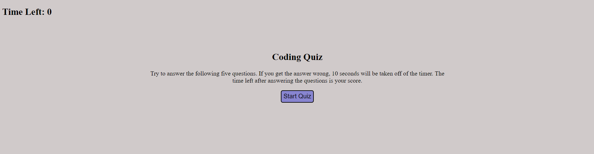

# Coding Quiz

# Description Of Application:
This is a five-question coding quiz. The user clicks on a Start button on the starting page, which starts a 100-second timer ticking down and prompts the user with the first of the five questions. If a user answers incorrectly, 10 seconds will be deducted from the timer. At the end of the five questions, the seconds remaining is the user's quiz score. At that point, user will be prompted to enter their initials, which will be saved to the high scores board by the user clicking a Submit button. The user will then see their initials and score displayed on the high scores page.

 

# Screenshot Of Application:

 
 

# Link To Deployed Website:
https://999888z.github.io/Coding-Quiz/